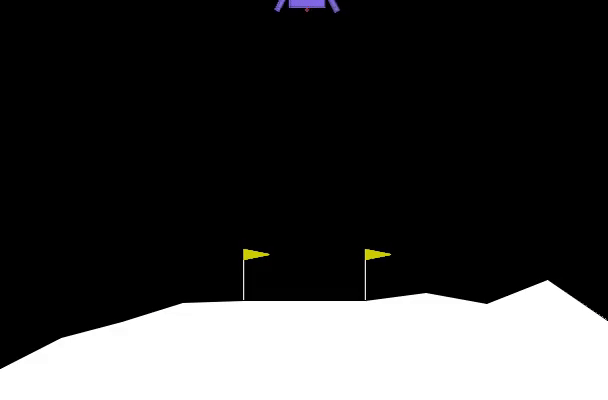
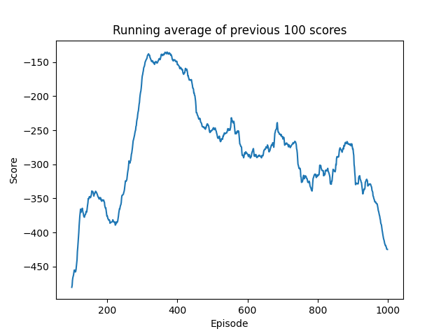

# Continuous Control with Deep Reinforcement Learning (DDPG)

> **Reimplementation of**:  
> 📄 *Continuous Control with Deep Reinforcement Learning*,  
> by Timothy P. Lillicrap\*, Jonathan J. Hunt\*, Alexander Pritzel, Nicolas Heess, Tom Erez, Yuval Tassa, David Silver & Daan Wierstra  
> 📍 Published at **ICLR 2016** — [arXiv:1509.02971](https://arxiv.org/abs/1509.02971)


---
## 📊 Results

| Agent Playing Lunar Lander (10 sec)                | Project Architecture Diagram       |
| --------------------------------------------------| --------------------------------- |
|  |  |


---
## 📌 Overview

This repository contains a PyTorch reimplementation of the **Deep Deterministic Policy Gradient (DDPG)** algorithm, which extends Deep Q-Learning to continuous control problems.

DDPG is a model-free, off-policy actor-critic algorithm that can learn policies in high-dimensional, continuous action spaces.

---

## 🛠️ Features

- ✅ Fully modular PyTorch implementation  
- ✅ Works with any OpenAI Gym continuous control environment  
- ✅ Actor-Critic with target networks  
- ✅ Experience Replay  
- ✅ Ornstein–Uhlenbeck noise for exploration  
- ✅ TensorBoard logging support
---


## 📂 Project Structure
```
project/
├── tmp/
│ └── ddpg/
│ ├── actorddpg
│ ├── criticddpg
│ ├── target_actorddpg
│ └── target_criticddpg
├── DDPG_Result.ipynb
├── execute.py
├── ddpg.py
├── project.png
└── lunarlander_10s_agent.mp4
```

Run the Jupyter Notebook

Open DDPG_Result.ipynb in Jupyter Notebook or JupyterLab.

    Important:
    When prompted about numpy installation and asked to restart the notebook, do not restart.
    Instead, choose No, then run this command in the next cell:
```
!python execute.py
```

This will run the trained agent and save the results.
